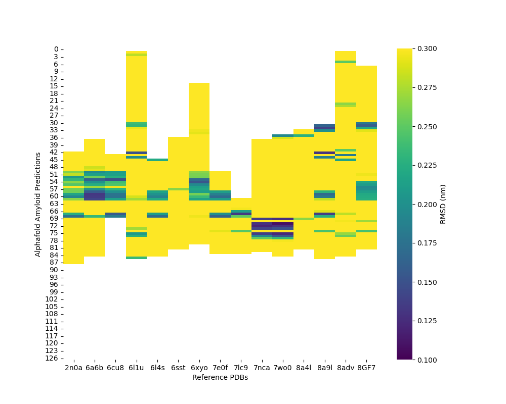
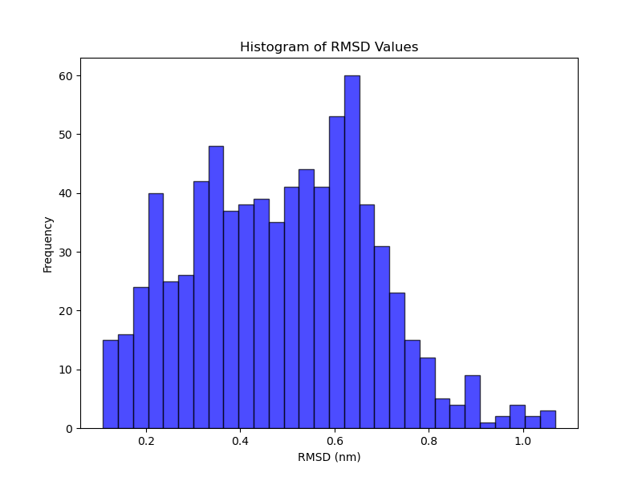
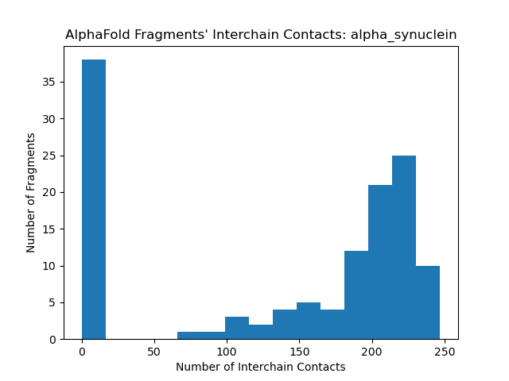
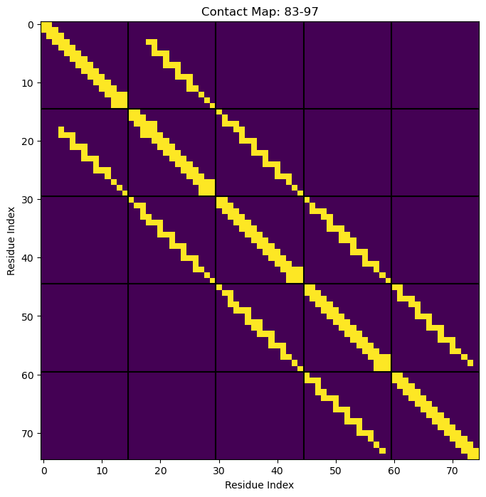
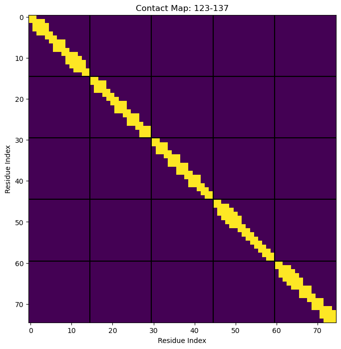
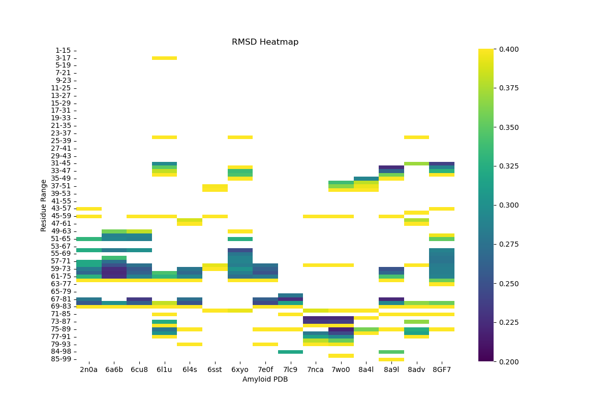
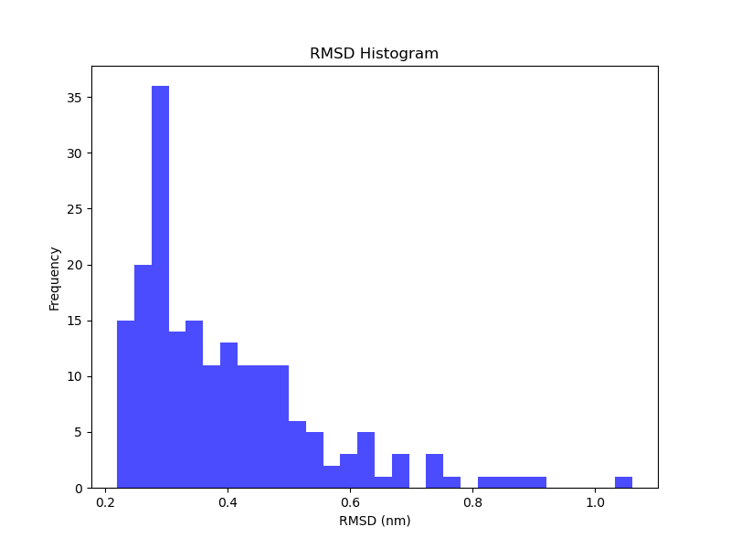

# amyloid_search

We are using Alphafold 2 and UCSB's scientific computing cluster POD to predict amino acid sequences likely to form amyloid fibrils in solution. 

## Table of Contents

- [About](#about)
- [Usage](#usage)
- [Scripts](#scripts)
- [Results](#results)

## About

Amyloid proteins are a group of misfolded proteins that aggregate into insoluble fibrils. These fibrils are characterized by high densities beta-sheets that stack together, eventually forming amyloid plaques. When amyloid fibrils accumulate, they disrup normal tissue function, leading to diseases such as Alzheimers, ALS, Parkinsons, MSA, and other degenerative illnesses. Techniques such as cryogenic electron microscopy (CEM) have allowed researchers to map out the structures of these misfolded proteins. This coding project seeks to determine which sequences of amino acids are most responsible for amyloid formation. Amino acid snippets between 13-19 residues long are folded into mock amyloid structures using Alphafold 2. These snippets are then analyzed for root mean square deviation (RMSD) from the CEM structures and their magnitude of intermolecular contacts. Amino acid snippets with low RMSD scores and high intermolecular contact scores are likely to for amyloid fibrils in solution. 

## Usage

To predict movel amino acid sequences likely to form amyloid fibrils:

### Prerequisites

- Python 3.12 or later
- Alphafold 2
- Python MDAnalysis Library
- Access to scientific computing cluster with Colabfold

### Installation

Clone the repository and install the required packages

```bash
git clone https://github.com/samlobe/amyloid_search.git
cd amyloid_search
#MDAnalysis highly recommended for functionality
conda install -c conda-forge mdanalysis
```

## Scripts
**make_fasta.py**: This script generates a fasta document with 5 snippets of fraglength spaced increment apart. They are formatted as (snippet)(10*U)...(10*U)(snippet). When these snippets are simulated in Alphafold they will fold into amyloid shapes. 
**Alignemnt_MDAnalysis.py**: Creates aligned PDB files with same shape as Alphafold predictions if RMSD < RMSD_threshold and Interchain Contacts > interchain_threshold
**alphafold_intermolecular_contacts.py**: Creates aligned PDB files with same shape as Alphafold predictions if RMSD < RMSD_threshold and Interchain Contacts > interchain_threshold
**fix_resid_chainid.py**: Takes aligned alphafold pdb files and renumbers the residues and chains for streamlined analysis
**Initial_RMSD.py**: Calculate RMSD between AlphaFold predictions and reference PDB structures using MDAnalysis. Store results as a dataframe and optionally generate a heatmap.
**rmsd_after_filtering.py**: Run an additional RMSD calculation for refined list of Alphafold structures generated by Alignment_MDAnalysis.py


## Results

Initial heatmap of unfiltered RMSD results:


Initial histogram of unfiltered RMSD results:


Initial histogram of interchain contacts:


Example of a interchain contact map likely to form amyloids:


Example of an interchain contact map unlikely to form amyloids:


Heatmap of filtered RMSD results:


Histogram of filtered RMSD results:

